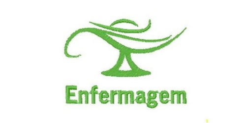

<div align="center">
  <a href="README.md">
    
  </a>
  <a href="README_en.md">
    
  </a>
  <a href="README_sp.md">
    
  </a>
</div>

<br>

<h1 align="center">
    
    <p style="text-align: center;">Día de la Enfermería 🩺</p>
</h1>


<h2 align="center"><a href="https://enfermagemprozeducacao.000webhostapp.com/index.html">Visita el sitio</a></h2>

<br>

<h2>Enlaces</h2>
<ul>
  <li style="text-align: justify;"><a href="https://docs.google.com/document/d/1WuYvjAdWnVU9WSGyuHAWhajazxlNZiMKVlqbwtWjR6Q/edit?usp=sharing">Documentación</a></li>
  <li style="text-align: justify;"><a href="https://github.com/guisilvas/website-enfermagem">Proyecto</a></li>
  <li style="text-align: justify;"><a href="https://enfermagemprozeducacao.000webhostapp.com/index.html">Dirección</a></li>
</ul>

<br>

<h2>Acerca de</h2>
<p style="text-align: justify;">En homenaje al día de la Enfermería, este sitio presenta algunas propuestas tanto para estudiantes/profesionales del área como para personas que eventualmente recibirán su atención. Se trata de un sitio educativo e informativo sobre la profesión y cómo debemos comportarnos ante ella.</p>

<br>

<h2>Herramientas</h2>
<ul>
  <li style="text-align: justify;"><a href="https://www.w3.org/TR/html/">HTML</a></li>
  <li style="text-align: justify;"><a href="https://www.w3.org/TR/html/">CSS</a></li>
  <li style="text-align: justify;"><a href="https://developer.mozilla.org/docs/Web/JavaScript/Guide">JavaScript</a></li>
  <li style="text-align: justify;"><a href="https://getbootstrap.com/">Bootstrap</a></li>
  <li style="text-align: justify;"><a href="https://www.php.net/">PHP</a></li>
</ul>

<br>

<h2>Objetivo</h2>
<p style="text-align: justify;">En homenaje al día de la enfermería, el grupo de Desarrollo de Sistemas DIV/DEV/1M de Proz Educación ha creado un sitio web para reconocer y valorar la profesión. Durante mucho tiempo, la enfermería en Brasil ha sido vista como un campo poco valorado y una alternativa a la medicina, pero afortunadamente en los últimos años ha recibido el reconocimiento que merece, y hemos decidido hacer este pequeño homenaje a estos grandes profesionales.</p>

<br>

<h2>Proceso de Creación</h2>
<h3>Requisitos:</h3>
<p style="text-align: justify;">A partir de los informes de los estudiantes sobre la profesión, se establecieron requisitos funcionales y no funcionales para la creación de un sitio web con el objetivo de valorar la Enfermería. Algunos puntos no funcionales incluyen secciones de apoyo tanto para profesionales como para pacientes, y un blog de noticias. El manejo de temas como la salud mental y la colaboración en el entorno laboral son ejemplos de requisitos no funcionales abordados en este proyecto.</p>

<h3>Desarrollo y Pruebas:</h3>
<p style="text-align: justify;">Inicialmente, se creó la parte frontend del sitio utilizando una plantilla completamente rediseñada con el contenido del tema. Manteniendo parte del sitio web y adaptándolo a las necesidades de los requisitos, se creó el frontend. El backend, estructurado desde el principio, cuenta con una base de datos que puede almacenar el envío de formularios por parte de los usuarios y registrar este contacto para posibles informes posteriores.</p>

<h3>Hosting:</h3>
<p style="text-align: justify;">El sitio se ha alojado en un servicio de hosting gratuito, 000Webhost, lo que limita en gran medida sus funciones y hace que acciones como el envío de boletines a los usuarios sean inviables. Sin embargo, el sitio está activo y en funcionamiento.</p>

<br>

<h2 style="text-align: justify;">Contribuye</h2>

```bash
# Clona el repositorio

git clone https://github.com/guisilvas/website-enfermagem.git

```

<br>

<h2>Colaboradores</h2>

<br>

<p>- Profesor: <a href="#">Felipe de Paula</a></p>

<br>

<p style="text-align: justify;">- Requisitos y Documentación</p>
<ul>
  <li style="text-align: justify;"><a href="https://github.com/Muniz-DuarteAnny">Anny Duarte</a></li>
  <li style="text-align: justify;"><a href="#">Bruno Santana</a></li>
  <li style="text-align: justify;"><a href="https://github.com/Gabriel037">Gabriel Mendonça</a></li>
  <li style="text-align: justify;"><a href="https://github.com/hriquerios">Henrique Rios</a></li>
  <li style="text-align: justify;"><a href="https://github.com/Luziacrdiniz">Luzia Rodrigues</a></li>
  <li style="text-align: justify;"><a href="https://github.com/PabloSoares1572">Pablo Soares</a></li>
</ul>

<br>

<p style="text-align: justify;">- Desarrollo y Pruebas</p>
<ul>
  <li style="text-align: justify;"><a href="https://github.com/brngom3s">Breno Gomes</a></li>
  <li style="text-align: justify;"><a href="https://github.com/DOzinhaha">Douglas Lima</a></li>
  <li style="text-align: justify;"><a href="https://github.com/guisilvas">Guilherme Silva</a></li>
</ul>

<br>

<p style="text-align: justify;">- Hosting</p>
<ul>
  <li style="text-align: justify;"><a href="https://github.com/brunagtmaia">Bruna Gontijo</a></li>
  <li style="text-align: justify;"><a href="https://github.com/DudaLeandra">Eduarda Leandra</a></li>
</ul>

<br>

---

<br>

<p align="center">por DIV/DEV/1M</p>